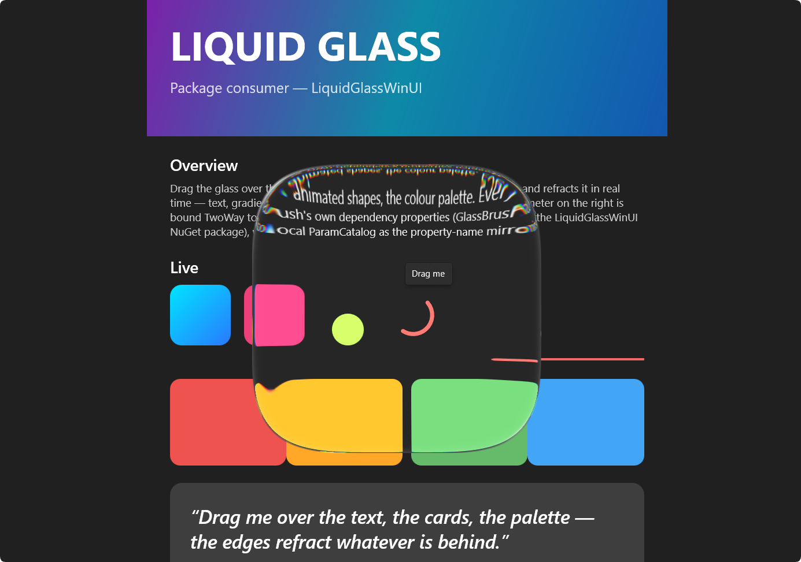

# LiquidGlassWinUI

[中文版 (Chinese)](./README.zh-CN.md)

A WinUI 3 `XamlCompositionBrushBase` that renders an Apple-style "liquid glass" material
over backdrop content. Drop a `<lg:LiquidGlassBrush />` into any control's `Background`
and get real-time refraction, chromatic dispersion, Fresnel rim, specular glare, and
tinted glass — all driven by dependency properties that bind and animate directly from XAML.

```xml
xmlns:lg="using:LiquidGlassWinUI"
...
<Rectangle Fill="{x:Null}">
  <Rectangle.Background>
    <lg:LiquidGlassBrush BlurAmount="1.93"
                         DispersionRange="0.39"
                         Exposure="1.2"
                         GlareAngle="-135"
                         GlareConvergence="100"
                         GlareFactor="71.52"
                         GlareHardness="13"
                         GlareRange="36.13"
                         RefDispersion="3.5"
                         RefFactor="3.37"
                         RefFresnelFactor="21.96"
                         RefFresnelHardness="0"
                         RefFresnelRange="57.84"
                         RefThickness="80"
                         ShapeRadius="0.92"
                         ShapeRoundness="3.84"/>
  </Rectangle.Background>
</Rectangle>
```



## Project structure

| Directory | Role |
|---|---|
| `LiquidGlassWinUI/` | C# class library — `LiquidGlassBrush` and its effect pipeline. Ships as a NuGet package. |
| `LiquidGlassDemo/` | WinUI 3 demo app — interactive parameter tuning, XAML/C# snippet export. |
| `Native/` | C++/WinRT DLL — `CustomEffectRuntimeNative.dll`, the runtime that patches custom HLSL shaders into the DWM composition pipeline. |
| `BlendProbe/` | Internal research lab — 26+ test shaders and probes for verifying DWM effect/linker behaviour. Not part of the shipped library. |

Solution: `LiquidGlassWinUI.slnx` (requires Visual Studio 2022+ or `dotnet` CLI with the `.slnx` extension).

## LiquidGlassBrush — public API

The brush exposes every material parameter as a `DependencyProperty`. All 19 parameters bind and animate from XAML with no code-behind.

### Refraction

| Property | Default | Range | Description |
|---|---|---|---|
| `RefThickness` | 20 | 1–80 | Refraction edge thickness (logical px) |
| `RefFactor` | 1.4 | 1–4 | Index of refraction |
| `RefDispersion` | 7 | 0–50 | Chromatic dispersion strength |
| `DispersionRange` | 1.0 | 0–1 | How far into the glass dispersion attenuates (0 = edge only, 1 = full) |
| `RefFresnelRange` | 30 | 0–100 | Width of the Fresnel refraction band near grazing angles |
| `RefFresnelHardness` | 20 | 0–100 | Falloff sharpness of the Fresnel band |
| `RefFresnelFactor` | 20 | 0–100 | Strength multiplier for the Fresnel rim |

### Glare

| Property | Default | Range | Description |
|---|---|---|---|
| `GlareRange` | 30 | 0–100 | Angular width of the specular glare streak |
| `GlareHardness` | 20 | 0–100 | Falloff sharpness of the glare streak |
| `GlareFactor` | 90 | 0–100 | Primary glare intensity |
| `GlareConvergence` | 50 | 0–100 | How tightly glare converges toward its centre |
| `GlareOppositeFactor` | 80 | 0–100 | Secondary (opposite-facing) glare intensity |
| `GlareAngle` | -45 | — | Glare streak direction in degrees |

### Blur & Tint

| Property | Default | Range | Description |
|---|---|---|---|
| `BlurAmount` | 1.0 | — | Backdrop blur radius (px). Set to 0 to bypass the blur chain entirely. |
| `TintR` / `TintG` / `TintB` | 255 | 0–255 | Glass tint colour channels |
| `TintA` | 0 | 0–1 | Tint opacity (0 = clear, 1 = fully tinted) |
| `Exposure` | 1.0 | 0.6–1.6 | Backdrop brightness gain |

### Shape

| Property | Default | Range | Description |
|---|---|---|---|
| `ShapeRadius` | 0.4 | 0–1 | Corner radius as a fraction of the shorter half-side |
| `ShapeRoundness` | 5 | 2–8 | Superellipse roundness exponent |

### Diagnostics

| Member | Description |
|---|---|
| `Dpr` (float) | Physical-px-per-logical-px override. Leave at 0 to auto-measure from system DPI. |
| `LastError` (static string) | If the effect fails to compile/link, the error is surfaced here instead of crashing. |

## How it works under the hood

`LiquidGlassBrush` builds a Win2D `CompositionEffectBrush` chain, but the effect nodes are
**not** built-in Win2D effects — they are custom HLSL shaders registered through the
`CustomEffectRuntime`.

### CustomEffectRuntime (native)

`Native/CustomEffectRuntime.Native.vcxproj` builds `CustomEffectRuntimeNative.dll`, a
C++/WinRT DLL that dynamically patches the DWM composition pipeline at runtime:

1. **IAT hook on `wuceffectsi.dll`** — intercepts `EffectType::FromGuid` and
   `CompileEffectDescription` so custom effect GUIDs are recognised as valid effect types.
2. **`RuntimeGraphicsEffect`** — a C++/WinRT class implementing `IGraphicsEffect` and
   `IGraphicsEffectD2D1Interop`, which `Compositor::CreateEffectFactory` accepts as a
   standard effect node.
3. **Shader linking** — when DWM traverses the effect graph, the hook returns a synthetic
   `CompiledResult` containing the custom HLSL bytecode, entry points, and linking
   parameters (custom sampler UV, sampler data, cbuffer bindings).

The C# side (`Effects/CustomEffectBase.cs`, `Interop/CustomEffectBuilder.cs`,
`Interop/CustomEffectInterop.cs`) assembles the effect definition — HLSL source (embedded
resource), cbuffer layout, source bindings, shader arguments — and marshals it to the
native runtime via P/Invoke.

The end result: custom pixel shaders run inside the standard `CompositionEffectBrush`
pipeline, with no app-side intermediate surfaces or render targets.

### HLSL shaders (embedded)

| Shader | Purpose |
|---|---|
| `LiquidGlass.hlsl` | Main glass material — SDF, refraction, dispersion, Fresnel, glare, tint, AA |
| `BlurH.hlsl` | 1D horizontal separable Gaussian (bilinear-merged, 21 taps → 10 pairs) |
| `BlurV.hlsl` | 1D vertical separable Gaussian (same kernel) |

All shaders are embedded as `<EmbeddedResource>` in the assembly — no loose files in the
consumer's output directory.

## Building

### Prerequisites

- Windows 11 (x64) or Windows 10 (x64, 19041+)
- Visual Studio 2022 with the Windows App SDK workload
- .NET 8 SDK

### Build the native DLL first

```powershell
msbuild Native/CustomEffectRuntime.Native.vcxproj /p:Configuration=Release /p:Platform=x64
```

This produces `Native/Output/x64/Release/CustomEffectRuntimeNative.dll`. The managed
library's `.csproj` references this path; the NuGet pack target checks that it exists.

### Build the managed projects

```powershell
# Build the class library
dotnet build LiquidGlassWinUI/LiquidGlassWinUI.csproj -c Release

# Build and run the demo
dotnet build LiquidGlassDemo/LiquidGlassDemo.csproj -c Release
```

Or open `LiquidGlassWinUI.slnx` in Visual Studio and build the whole solution.

### Install

```powershell
dotnet add package LiquidGlassWinUI
```

> **Project-reference consumers:** MSBuild does not transitively copy native DLLs
> from `<ProjectReference>`. If you reference the `.csproj` directly (not via NuGet),
> add this to your project after building `Native\CustomEffectRuntime.Native` in
> `Release|x64`:
> ```xml
> <Content Include="path\to\Native\Output\x64\Release\CustomEffectRuntimeNative.dll"
>          CopyToOutputDirectory="PreserveNewest"
>          Link="CustomEffectRuntimeNative.dll"
>          Visible="false" />
> ```
```

## Platform support

- **x64 only.** The native runtime (`CustomEffectRuntimeNative.dll`) is built for x64. The
  NuGet `.targets` will fail the build with an actionable message on x86 or ARM64.
- **Windows App SDK 2.2.0+** (targets `net8.0-windows10.0.19041.0`).

## Error diagnostics

If the custom effect fails to compile or link (e.g. the shader is too complex for the
current DWM version, or the hook cannot be installed), the brush sets its
`CompositionBrush` to a solid red fill instead of throwing, and writes the error to
`LiquidGlassBrush.LastError`. The host app does not crash.

## BlendProbe

`BlendProbe/` is an internal research tool, intentionally kept separate from the shipping
library. It contains 26+ HLSL test shaders and corresponding effect definitions used to
systematically probe DWM effect/linker behaviour — multi-source topologies, sampler types,
flatten modes, and shader argument combinations. It is the sandbox where new effect
patterns are verified before being promoted into the production `LiquidGlassWinUI` library.

## Acknowledgements

- [WUILiquidGlassDemo](https://github.com/apkipa/WUILiquidGlassDemo) — Windows App SDK reverse-engineering and composition hook reference
- [liquid-glass-studio](https://github.com/iyinchao/liquid-glass-studio) — Liquid glass shader reference implementation
